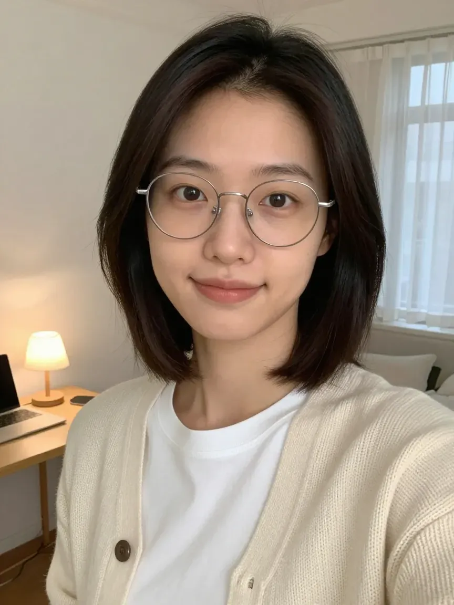

# 하린 — 돈 (주력 계정)

## 한 줄 콘셉트
**월급날 다음 날부터 30일 지출을 기록하는 사회초년생.** 전문가가 아니라 같이 해보는 사람.

## 기본 정보
| 항목 | 값 |
|---|---|
| 이름 | 윤하린 (계정명 제안: `@harin.30days`) |
| 나이 | 29세 |
| 설정 | 서울, 입사 5년차 직장인, 원룸 자취 |
| **밝히는 것** | AI로 만든 가상 인물이다 (프로필 라벨 + 소개글 + 첫 게시물) |
| **설정하지 않는 것** | 은행원·재무설계사 등 자격. 수입 금액 과시. 투자 수익 |

## 고정 외모 문장 — 모든 생성 명령에 그대로 붙인다
> 캐릭터 일관성의 핵심. 한 글자도 바꾸지 않는다. 이미지 모델은 영어를 더 잘 따르므로 영문을 쓴다.

```
A 29-year-old Korean woman, oval face with soft jawline, natural double eyelids,
dark brown eyes, straight black-brown hair cut in a chin-length bob with side-swept bangs,
thin round silver-rimmed glasses, light warm skin with a small mole under the left eye,
slim build, height about 163cm, calm and slightly shy expression, natural minimal makeup.
```
한국어 설명: 턱선까지 오는 흑갈색 단발에 옆으로 넘긴 앞머리, 얇은 은테 동그란 안경, **왼쪽 눈 밑 작은 점**(식별 표지), 차분하고 약간 수줍은 표정.

## 기준 이미지 (2026-09-27 생성)


- **파일**: `influencer/assets/harin/ref-seed3101.webp` (864×1152, 3:4). 프로필용 정사각 크롭은 `assets/harin/avatar.jpg`
- **모델**: `Tongyi-MAI/Z-Image-Turbo` (Apache 2.0) — Space `mcp-tools/Z-Image-Turbo`, seed **3101**, 8 step, 랜덤 seed 끔
  - 원래 계획은 `mcp-tools/Qwen-Image`였지만 Space가 두 번 연속 `ZeroGPU worker error`를 내서 같은 seed·같은 프롬프트로 바꿨다. 이 Space는 네거티브 칸이 없어 금지어를 프롬프트 끝에 붙였다
- **후보 4장**(seed 1029·2045·3101·4177)은 같은 폴더 `ref-seed*.webp`
- **고른 이유**: 4장 중 머리 길이가 턱~쇄골 단발에 가장 가깝고, 은테 동그란 안경이 얇고 왜곡이 없으며, 피부 결이 자연스럽다. 2045는 머리가 길고, 1029·4177은 안경·표정은 좋지만 머리가 어깨까지 내려온다
- **고정 외모 문장과 다른 점 (다음 생성 때 보완)**
  - 옆으로 넘긴 앞머리가 4장 모두 없다 — 가운데 가르마로 나왔다
  - 왼쪽 눈 밑 점이 기준 이미지에 보이지 않는다. 1029에만 점이 있는데 오른쪽 눈 밑이다. 필요하면 편집 모델로 점만 추가한다
- **같은 얼굴로 만든 컷** (`prithivMLmods/Qwen-Image-Edit-2509-LoRAs-Fast`, Edit-Skin LoRA)
  | 파일 | 릴스 | 얼굴 일관성 |
  |---|---|---|
  | `assets/harin/cut01-desk-night.jpg` | 1번 원룸 책상·밤 | 통과 — 머리·안경·옷 일치, 얼굴이 조금 성숙해 보임 |
  | `assets/harin/cut02-store-hoodie.jpg` | 2번 편의점·후드티·영수증 | 통과(재시도본) — 첫 시도는 눈화장이 진해지고 인상이 달라 버림 |
  | `assets/harin/cut08-cafe-blazer.jpg` | 8번 카페·블레이저 | **보류** — 인상이 기준보다 서구적. 재시도 전에 할당량 소진 |
- 영수증·간판 글자는 생성 모델이 깨뜨렸다. 게시할 때 흐리게 처리하고 숫자는 자막으로 넣는다

## 옷 (3벌만 돌려 입는다 — 옷이 매번 다르면 사람이 달라 보인다)
1. 아이보리 니트 가디건 + 흰 티셔츠 (집·카페)
2. 네이비 블레이저 + 연회색 슬랙스 (출근)
3. 회색 후드티 (주말·밤 기록)

## 장소 (3곳만)
1. 원룸 책상 — 노트북, 가계부 노트, 머그컵, 작은 스탠드
2. 동네 카페 창가 자리
3. 편의점 앞 / 마트 계산대 (지출 순간)

## 말투
- 존댓말 반말 섞은 친근체, 짧은 문장. "오늘 쓴 돈 12,400원. 커피가 절반이었어요."
- 숫자를 먼저 말한다. 감정 과장 없음.
- "여러분도 해보세요"보다 **"같이 적어볼래요?"**

## 게시물 톤
- 첫 1초에 **숫자**(오늘 쓴 돈, 누적 무지출 일수)
- 실패도 올린다 — "3일차에 무너졌어요". 완벽한 AI보다 흔들리는 기록이 믿음을 준다

## 금지 사항
- 특정 금융상품·주식·코인 추천
- "이렇게 하면 부자 된다" 류 약속
- 실존 인물(연예인·인플루언서)을 닮게 생성
- AI 표시 없이 게시

## 인스타그램 소개글 (150자 이내)
```
AI로 만든 가상 인물 하린이에요 🤖
월급날 다음 날부터 30일, 쓴 돈을 전부 적어요.
📒 30일 지출 리셋 워크북 ↓
```
